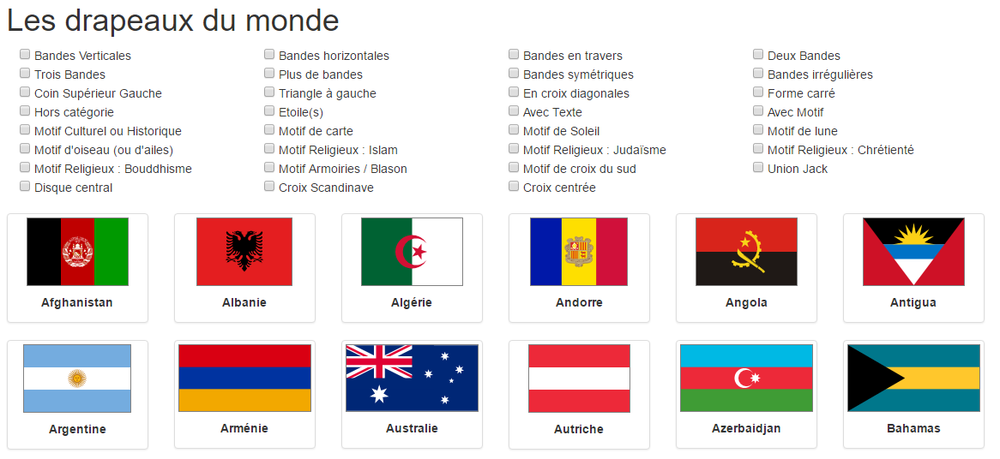

# Flags of the World

Display flags of the world from a CSV file, to features to filter on (stripes, stars, ...)

## Installation and run

1. [Install NPM](https://www.tutorialspoint.com/nodejs/nodejs_environment_setup.htm)
2. Clone this repository
3. Install dependencies with `npm install`
4. Run server with `npm start`. It will run on port 8080 on your local machine. Go to http://localhost:8080/ to browse it.

## Update data

I uploaded in `data/` the sheet in .ods format (LibreOffice). To update it and use it in the application, do:

1. Save the file as a CSV in UTF-8 encoding
2. Run the command `nohup node convertdata.js > data/flags.json`. It will generate a json file in data/flags.json, referenced in the code

Then restart the server as previously mentioned.
